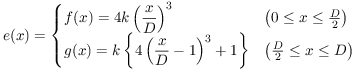

# Easing Functions

## Variables

- `x`: time
- `D`: duration (x-axis amplifier)
- `k`: y-axis amplifier

## Linear

## Cubic

Alternatives: Formula derivation by measuring geometrically area:

## License

Authored by Retorillo

No Rights Reserved (CC0 License)
